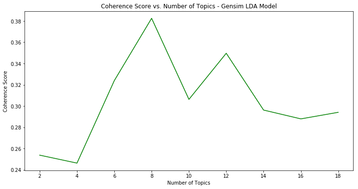
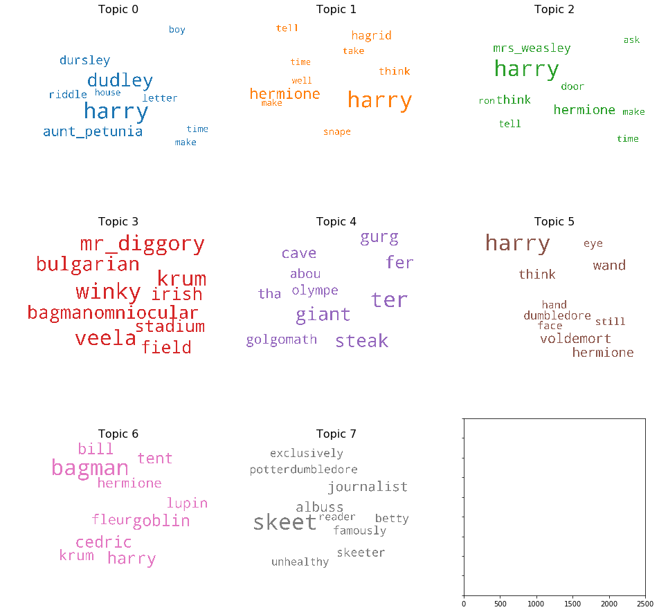

# Harry Potter NLP Technical Exercise

by Matt Devor

# NLP

Natural Language Processing (NLP) is a sub-field of machine learning that attempts to make human languages (e.g. English, French, Mandarin) machine readable and interpretable. 
NLP poses notoriously difficult challenges, including the ambiguity of written text, the variability of meaning given context, the use of slang, idioms and abbreviations, the use of metaphor and analogy, and deciphering the true intent of a writer.

The nuts and bolts of NLP include all of the following:
1. Text extraction in a conistent and reliable format from multiple channels across multiple sources of truth.
2. Text sanitization including removal of artifacts from web sources such as url-encoding, HTML markup, CSS tags and inline javascript.
3. Lemmatization and stemming for normalization.
4. Part-of-speech tagging, named-entity recognition, dependency parsing or other advanced linguistic models.
5. Topic modeling, document clustering or other high-level abstractions.

# Challenge
Let's suppose you never read the Harry Potter series (my sincerest apologies).  
Now suppose you want to get the gist without spending dozens of hours watching the movies or hundreds of hours reading the books (although you really should).  
How could you leverage natural language processing to quickly extract topics, themes, or plotlines?  

Specifically, attempt to algorithmically assign a title and synopsis to each document (in this case let's consider each chapter as a document);
and then repeat the process at the level of topics (that is, identify topics from the corpus of text, and assign a title and synopsis to each topic).

Assume steps 1 & 2 have been completed for you with a robust ETL pipeline.  
Tackle steps 3, 4 and 5, with emphasis on step 5.  
The number of topics and how you present your findings is entirely up to you.  
One catch -- please refrain from using the python library LDAvis -- we want to see how you build from the ground up.  
That said, you may use any other machine learning or NLP library for underlying computations and/or transfer-learning. 

## Guidelnes

1. Do not copy source code from anywhere. We want to see how you would approach this problem yourself.
2. Your code should be written primarily in Python.
3. Your code should run.
4. Don't worry about fancy optimizations, edge cases, bells or whistles.
5. Timebox your efforts to a maximum of 8 hours.
6. The result of your efforts should be a pull-request to this repository. 

## Considerations
Finally, one of the most important considerations for a full-stack data scientist is the ability to write production software. The best model is only as good as its deployment. Please use this opportunity to:

1. Demonstrate your ability to write clean code that is robust, modular and well structured.
3. Demonstrate software engineering best practices including self-documenting code, test-driven development, atomic-commits and source control.

Oh and have fun!


## Table of Contents


# Introduction
I am actually a huge fan of the Harry Potter books, but haven't read them lately, so this project was a great refresher for me.

As far as approaching this problem, I divided it into two main chunks: 

**Text Summarization**
 - I did quite a bit of research before diving in, there are two main categories of text summarization techniques, **Extractive** and **Abstractive**. 
    - Extractive Summarization: Methods rely on extracting several parts from a corpus of text, such as phrases and sentences, and stacking them together to create a summary. As such, identifying the right sentences for summarization is of utmost importance in an extractive method.
    - Abstractive Summarization: These methods use advanced NLP techniques to generate an entirely new summary. Some parts of this summary may not even appear in the original text, as these methods simulate how humans would summarize text.
  - I chose to focus on extractive techniques for this project, as the models I researched that use abstracive summarization are primarily deep learning methods that have better results on smaller paragraphs, vs. the entire chapters that need to be summarized for this project. 
  - Below, I have presented several text summarization methodologies, and the methodology I consider the best has been implemented in the final version of the code. 

**Topic Modeling**
- For topic modeling, I chose to use Latent Dirichlet Allocation, due to its ease of interpretation, and the robust model the Gensim library contains. 
- I also chose to use Gensim because it was out of my comfort zone, compared to sklearn, and I thought this would be a great opportunity to continue learning. 
- NMF and SVD would potentially be valid techniques as well, and could be additional methods to explore further. 


[Back to Top](#Table-of-Contents)

# Strategy and Process
- Overview of Data
- Text Summarization
- Topic Modeling: LDA with Gensim/spaCy
- Combining Summarization and Topic Modeling
- Reflection and Future Work

# Overview of the Data
- The dataset consists of the full extracted text of all seven of the Harry Potter books, and includes the following fields:
  - book_author: J.K. Rowling for all books (string)
  - book_name: Name of each book (string)
  - chapter: Chapter number (integer)
  - chapter_name: Name of chapter (string)
  - extracted_text: Entire text of the chapter (string)
- There are 198 chapters total.
- The last book in the series, 'Harry Potter and the Deathly Hallows', at ~178,000 words, is almost 2.5 times as long as the first book 'Harry Potter and the Philosophers Stone'.

The table below shows a summary of the dataset. 
Note the books are in the same order as the .csv source, which is not necessarily chronological.

| Book Name | Total Chapters | Total Word Count | Average Chapter Word Count | Average Word Length |
|----:|:------------------|:----------|:----------------------------|:--------------|
| Harry Potter and the Chamber of Secrets| 18 | 84,077 | 4,671 | 4.72 |
| Harry Potter and the Deathly Hallows | 36 | 178,107| 4,947 | 4.62 |
| Harry Potter and the Goblet of Fire | 37 | 178,312 | 4,819 | 4.56 |
| Harry Potter and the Half Blood Prince | 30 | 162,797 | 5,427 | 4.65 |
| Harry Potter and the Order of the Phoenix | 38 | 208,783 | 5,494 | 4.66 |
| Harry Potter and the Philosophers Stone | 17 | 77,346 | 4,550 | 4.49 |
| Harry Potter and the Prisoner of Azkaban | 22 | 104,661 | 4,757 | 4.61 |


[Back to Top](#Table-of-Contents)

# Text Summarization
As mentioned above, I decided to focus on extractive text summarization methodolgies, and the python libray ```sumy ``` has quite a few options for summarization, is quite easy to use, and produces results quickly. 

I initially decided to try out several different text summarization techniques, and evaluate them all on the same chapter. In terms of evaluation, since comprehension is quite difficult to quantify, I read through each summary manually, and made a judgement call as to which one was "best", in order to use that as the default summarizer.

However, I set up the file ```hp_text_summarization.py``` to be quite dynamic, as the user can use argument parsing to select the following variables:
  - -filepath: File path to the harry potter dataset (csv)
  - -summarizer: The summarizing algorithm to use
  - -length: The number of sentences to use in each chapter summary
  - -savetxt: Boolean that allows the user to save results to text file. If False, output is just printed to the terminal.

Example command line execution:
```
python hp_text_summarization.py -filepath 'data/Harry_Potter_Clean.csv' -summarizer TextRankSummarizer -length 5 -savetxt True
```


# Topic Modeling: LDA with Gensim/spaCy

Latent Dirichlet Allocation is an unsupervised modeling technique, used to derive (k=num_topics) latent topics from corpuses of text (collections of documents). There are many examples of real-world use cases for this technique, such as search engines, text to speech, classifying social media users, and many more. 

Gensim makes it very easy to create bigram and or trigram models, and spaCy's lemmitization feature allows one to take use the parts of speech they are interested in. In this case, I decided to only use nouns, adjectives, verbs, and adverbs, in order to reduce the amount of words that would be less useful to differentiate topics. 

The LDA algorithm takes an input X matrix (which is the term document frequecy matrix from the corpus) and creates phi and theta matrices, which relate to the input matrix as follows:

| Matrix | Dimensions| Relates | Contains |
|---|---|---|---|
|X (input) | n x m | documents (n rows) to features/words (m columns) | Term frequency matrix of tokenized words, i.e. the number of times each word appears in each document. |
|φ (phi) | k x m | topics (k rows) to features/words (m columns) | Composition of topics, in terms of which words comprise each topic. All rows sum to 1. |
|θ (theta) | n x k | documents (n rows) to topics (k columns) | Topic distribution within each document. Each document can contain multiple topics. All rows sum to 1. |

As with any unsupervised modeling technique, as there is nothing we are really "predicting" with this approach, it is quite difficult to accurately evaluate an LDA model quantitatively. Much of the value gained from topic modeling, and LDA specifically, is the ability to come up with a human-comprehensible understanding of the topics the model spits out. While optimally this topic labelling can be done by looking at the most important keywords for each topic, it can still be quite difficult to separate topics into concrete "buckets".

 I took the following steps to clean the data and feed it through Gensim's LDA model. The corpus in this case is the text from each chapter, and I'm treating each chapter as a document.
1. Remove all punctuation, convert to lower case, and split each document into individual words.
2. Remove stopwords, create bigrams (so important two-word phrases are captured, and lemmatize each word. 
3. Choose k = num_topics.
4. Create LDA model using Gensim.
5. Look **manually** at most important key words for each topic, and if words are repeated often between topics, add to stopwords list, and re-run the LDA model.

In order to have a more quantitative approach to evaluating an LDA model, I decided to focus on Gensim's "Coherence" score, which is basically of how well a topic model splits documents into easily definable topics. This has been shown to mirror human reasoning better than perplexity, so that is why I chose this metric. 

The plot below shows how the coherence score changes as the number of topics increases. From this chart, it looks like the optimal number of topics is 8, so I decided to use that for the final model. However, there is always a balance between human interpretbility, and number of topics, and it can often be very difficult to assign "good" titles to a large number of topics, depending on the corpus.




Keywords with 8 topics, and these stopwords:

Wordcloud with 8 topics


For this model, I also went through many iterations of adding to the stop words list, and these are the additional stop words I used, in order to see more differentiation between the topics:

```


```





From the chart above, it appeared that 14 topics resulted in a good balance between number of topics and coherence score, as coherence score didn't increase much after that. As such, I then re-ran the gensim LDA model with 14 topics, and the gif below is a two-dimensional representation of those topics, along with the 30 most important words for each topic. As we can see, the bulk of the language used within Seinfeld episodes overlaps considerably, with the episodes that are quite different from the norm being shown as smaller topics that are further away from the first 5.


[Back to Top](#Table-of-Contents)

# 


[Back to Top](#Table-of-Contents)

# Reflection and Future Work
## Reflection
- Overall, this was a really fun corpus to work with, and I was able to accurately summarize each chapter of Harry Potter
- For topic modeling, LDA really focused on character 

## Future Work
- In terms of title creation for each chapter, I believe an abstrative deep learning methodology would be very interesting to implement.
- Transfer learning might be helpful for this task, and while this model seems to have a very robust algorithm, I think it might need additional data to train with.

[Back to Top](#Table-of-Contents)


[(0,
  '0.010*"fudge" + 0.007*"prime_minister" + 0.005*"wizard" + '
  '0.005*"dumbledore" + 0.004*"think" + 0.004*"dementor" + 0.004*"frank" + '
  '0.004*"witch" + 0.004*"ask" + 0.004*"riddle"'),
 (1,
  '0.016*"slughorn" + 0.008*"ogden" + 0.007*"morfin" + 0.006*"gaunt" + '
  '0.005*"muggle" + 0.005*"think" + 0.004*"krum" + 0.004*"wizard" + '
  '0.004*"tent" + 0.003*"wear"'),
 (2,
  '0.012*"hagrid" + 0.007*"greyback" + 0.007*"wand" + 0.006*"centaur" + '
  '0.005*"shout" + 0.005*"fly" + 0.005*"death_eater" + 0.005*"malfoy" + '
  '0.004*"face" + 0.004*"tree"'),
 (3,
  '0.007*"think" + 0.006*"tell" + 0.005*"ron" + 0.005*"snape" + 0.005*"malfoy" '
  '+ 0.005*"take" + 0.005*"make" + 0.005*"time" + 0.004*"hagrid" + '
  '0.004*"want"'),
 (4,
  '0.007*"dudley" + 0.006*"think" + 0.005*"take" + 0.005*"time" + 0.005*"make" '
  '+ 0.004*"tell" + 0.004*"door" + 0.004*"well" + 0.004*"eye" + 0.004*"turn"'),
 (5,
  '0.024*"hagrid" + 0.007*"think" + 0.006*"tell" + 0.006*"mrs_weasley" + '
  '0.006*"ask" + 0.005*"want" + 0.005*"well" + 0.005*"ter" + 0.005*"take" + '
  '0.004*"bill"'),
 (6,
  '0.002*"portkey" + 0.002*"amos_diggory" + 0.001*"apparat" + '
  '0.001*"stoatshead" + 0.001*"hill" + 0.001*"toffee" + 0.001*"mr_weasley" + '
  '0.001*"ticket" + 0.001*"hilltop" + 0.001*"porridge"'),
 (7,
  '0.008*"wand" + 0.008*"voldemort" + 0.007*"think" + 0.006*"snape" + '
  '0.005*"dumbledore" + 0.005*"eye" + 0.005*"still" + 0.005*"tell" + '
  '0.005*"face" + 0.005*"hand"')]


# 9 Topics, Harry and Hermoine added to stop words.
  [(0,
  '0.010*"fudge" + 0.007*"prime_minister" + 0.005*"wizard" + '
  '0.005*"dumbledore" + 0.004*"think" + 0.004*"dementor" + 0.004*"frank" + '
  '0.004*"witch" + 0.004*"ask" + 0.004*"riddle"'),
 (1,
  '0.016*"slughorn" + 0.008*"ogden" + 0.007*"morfin" + 0.006*"gaunt" + '
  '0.005*"muggle" + 0.005*"think" + 0.004*"krum" + 0.004*"wizard" + '
  '0.004*"tent" + 0.003*"wear"'),
 (2,
  '0.012*"hagrid" + 0.007*"greyback" + 0.007*"wand" + 0.006*"centaur" + '
  '0.005*"shout" + 0.005*"fly" + 0.005*"death_eater" + 0.005*"malfoy" + '
  '0.004*"face" + 0.004*"tree"'),
 (3,
  '0.007*"think" + 0.006*"tell" + 0.005*"ron" + 0.005*"snape" + 0.005*"malfoy" '
  '+ 0.005*"take" + 0.005*"make" + 0.005*"time" + 0.004*"hagrid" + '
  '0.004*"want"'),
 (4,
  '0.007*"dudley" + 0.006*"think" + 0.005*"take" + 0.005*"time" + 0.005*"make" '
  '+ 0.004*"tell" + 0.004*"door" + 0.004*"well" + 0.004*"eye" + 0.004*"turn"'),
 (5,
  '0.024*"hagrid" + 0.007*"think" + 0.006*"tell" + 0.006*"mrs_weasley" + '
  '0.006*"ask" + 0.005*"want" + 0.005*"well" + 0.005*"ter" + 0.005*"take" + '
  '0.004*"bill"'),
 (6,
  '0.002*"portkey" + 0.002*"amos_diggory" + 0.001*"apparat" + '
  '0.001*"stoatshead" + 0.001*"hill" + 0.001*"toffee" + 0.001*"mr_weasley" + '
  '0.001*"ticket" + 0.001*"hilltop" + 0.001*"porridge"'),
 (7,
  '0.008*"wand" + 0.008*"voldemort" + 0.007*"think" + 0.006*"snape" + '
  '0.005*"dumbledore" + 0.005*"eye" + 0.005*"still" + 0.005*"tell" + '
  '0.005*"face" + 0.005*"hand"')]


Topic Names:
 - Topic 0: Voldemnort, Tom Riddle, and the Horcrux
 - Topic 1: Wands, Eyes, and Dudley
 - Topic 2: The Weasley's and Wizards
 - Topic 3: Snape, Sirius, and Dumbledore
 - Topic 4: Greyback, Scabior, and a Prisoner
 - Topic 5: Hagrid, Ron, and Gryffindor
 - Topic 6: Hagrid, Snape, and the Eye
 - Topic 7: Professor Trelawney, Umbridge, and the Dream Oracle


```
  [(0,
  '0.009*"voldemort" + 0.008*"riddle" + 0.005*"wizard" + 0.005*"horcrux" + '
  '0.005*"prime_minister" + 0.005*"ask" + 0.005*"wand" + 0.004*"never" + '
  '0.004*"dobby" + 0.004*"wormtail"'),
 (1,
  '0.009*"wand" + 0.006*"eye" + 0.006*"voldemort" + 0.006*"hand" + '
  '0.006*"face" + 0.005*"dudley" + 0.005*"still" + 0.005*"door" + 0.005*"feel" '
  '+ 0.004*"voice"'),
 (2,
  '0.008*"mrs_weasley" + 0.005*"wizard" + 0.005*"ron" + 0.005*"door" + '
  '0.004*"ask" + 0.004*"fr" + 0.004*"time" + 0.004*"percy" + 0.004*"well" + '
  '0.004*"eye"'),
 (3,
  '0.008*"snape" + 0.006*"sirius" + 0.005*"well" + 0.005*"dumbledore" + '
  '0.005*"time" + 0.005*"ask" + 0.004*"give" + 0.004*"good" + 0.004*"voice" + '
  '0.004*"leave"'),
 (4,
  '0.015*"greyback" + 0.005*"scabior" + 0.005*"prisoner" + 0.004*"dirk" + '
  '0.004*"tent" + 0.002*"cellar" + 0.002*"griphook" + 0.002*"crouch" + '
  '0.002*"snatcher" + 0.002*"sword"'),
 (5,
  '0.016*"hagrid" + 0.005*"ron" + 0.005*"time" + 0.005*"good" + 0.004*"hand" + '
  '0.004*"gryffindor" + 0.004*"try" + 0.004*"team" + 0.004*"well" + '
  '0.004*"wood"'),
 (6,
  '0.007*"hagrid" + 0.006*"snape" + 0.004*"eye" + 0.004*"face" + 0.004*"head" '
  '+ 0.004*"ron" + 0.004*"malfoy" + 0.004*"time" + 0.004*"professor" + '
  '0.004*"turn"'),
 (7,
  '0.005*"professor_trelawney" + 0.004*"umbridge" + 0.003*"dream_oracle" + '
  '0.002*"trelawney" + 0.002*"inspect" + 0.002*"timetable" + 0.002*"moonstone" '
  '+ 0.002*"divination" + 0.002*"inspection" + 0.001*"note_clipboard"')]
  ```