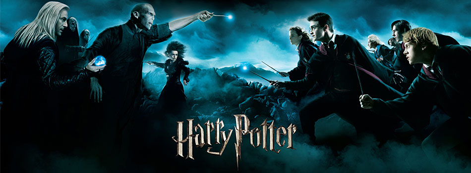

<!--  -->

# Harry Potter NLP Technical Exercise

by Matt Devor

## Table of Contents
- [Challenge](#challenge)
- [Introduction](#introduction)
- [Strategy and Process](#strategy-and-process)
- [Overview of the Data](#overview-of-the-data)
- [Text Summarization](#text-summarization)
  * [Extractive Methodologies Tested](#extractive-methodologies-tested)
      - [Results for each technique on Chapter 1 of Harry Potter and the Chamber of Secrets, "The Worst Birthday"](#results-for-each-technique-on-chapter-1-of-harry-potter-and-the-chamber-of-secrets-"the-worst-birthday")
- [Topic Modeling](#topic-modeling)
- [Combining Summarization and Topic Modeling](#combining-summarization-and-topic-modeling)
- [Reflection and Next Steps](#reflection-and-next-steps)
  * [Reflection](#reflection)
  * [Next Steps](#next-steps)

# Challenge
Let's suppose you never read the Harry Potter series (my sincerest apologies).  
Now suppose you want to get the gist without spending dozens of hours watching the movies or hundreds of hours reading the books (although you really should).  
How could you leverage natural language processing to quickly extract topics, themes, or plotlines?  

Specifically, attempt to algorithmically assign a title and synopsis to each document (in this case let's consider each chapter as a document);
and then repeat the process at the level of topics (that is, identify topics from the corpus of text, and assign a title and synopsis to each topic).

[Back to Top](#Table-of-Contents)

# Introduction
I am actually a huge fan of the Harry Potter books, but haven't read them lately, so this project was a great refresher for me. I also think the models I created will generalize well to any corpus of text where one would like generate summaries and latent topics. As far as approaching this problem, I divided it into two main chunks: 

**Text Summarization**
 - I did quite a bit of research before diving in, there are two main categories of text summarization techniques, **Extractive** and **Abstractive**. 
    - Extractive Summarization: Methods rely on extracting several parts from a corpus of text, such as phrases and sentences, and stacking them together to create a summary. As such, identifying the right sentences for summarization is of utmost importance in an extractive method.
    - Abstractive Summarization: These methods use advanced NLP techniques to generate an entirely new summary. Some parts of this summary may not even appear in the original text, as these methods simulate how humans would summarize text.
  - I chose to focus on extractive techniques for this project, as the models I researched that use abstractive summarization are primarily deep learning methods that have better results on smaller paragraphs, vs. the entire chapters that need to be summarized for this project. 
  - Below, I have presented several text summarization methodologies, and the methodology I consider the best has been implemented in the final version of the code. 

**Topic Modeling**
- For topic modeling, I chose to use Latent Dirichlet Allocation, due to its ease of interpretation, and the robust model the Gensim library contains. 
- Gensim was also chosen because of the built-in ability to calculate a coherence score for the LDA model, which has been shown to correlate better with human understanding than perplexity.
- I also chose to use spaCy, particularly for its speed, lemmatization features, and parts of speech tagging. 
- NMF and SVD would potentially be valid techniques as well, and could be additional methods to explore further. 

[Back to Top](#Table-of-Contents)

# Strategy and Process
- Overview of Data
- Text Summarization: Extractive Modeling Techniques
- Topic Modeling: LDA with Gensim/spaCy
- Combining Summarization and Topic Modeling
- Reflection and Future Work

[Back to Top](#Table-of-Contents)

# Overview of the Data
- The dataset consists of the full extracted text of all seven of the Harry Potter books, and includes the following fields:
  - book_author: J.K. Rowling for all books (string)
  - book_name: Name of each book (string)
  - chapter: Chapter number (integer)
  - chapter_name: Name of chapter (string)
  - extracted_text: Entire text of the chapter (string)
- There are 198 chapters total.
- The last book in the series, 'Harry Potter and the Deathly Hallows', at ~178,000 words, is almost 2.5 times as long as the first book, 'Harry Potter and the Philosophers Stone'.

The table below shows a summary of the dataset. 
Note the books are in the same order as the .csv source, which is not necessarily chronological.

|Book Name  | Total Chapters | Total Word Count | Average Word Count per Chapter | Average Word Length |
|----:|:------------------|:----------|:----------------------------|:--------------|
| Harry Potter and the Chamber of Secrets| 18 | 84,077 | 4,671 | 4.72 |
| Harry Potter and the Deathly Hallows | 36 | 178,107| 4,947 | 4.62 |
| Harry Potter and the Goblet of Fire | 37 | 178,312 | 4,819 | 4.56 |
| Harry Potter and the Half Blood Prince | 30 | 162,797 | 5,427 | 4.65 |
| Harry Potter and the Order of the Phoenix | 38 | 208,783 | 5,494 | 4.66 |
| Harry Potter and the Philosophers Stone | 17 | 77,346 | 4,550 | 4.49 |
| Harry Potter and the Prisoner of Azkaban | 22 | 104,661 | 4,757 | 4.61 |

[Back to Top](#Table-of-Contents)

# Text Summarization
As mentioned above, I decided to focus on extractive text summarization methodologies, and the python library ```sumy ``` has quite a few options for summarization, is quite easy to use, and produces results quickly. 

I initially decided to try out eight different text summarization techniques, and evaluate them all on the same chapter. In terms of evaluation, since comprehension/summarization is quite difficult to quantify, I read through each summary manually, and made a judgement call as to which one was "best", in order to use that as the default summarizer.

However, I set up the file ```hp_text_summarization.py``` to be quite dynamic, as the user can use argument parsing to select the following variables:
  - -filepath: File path to the harry potter dataset (csv)
  - -summarizer: The summarizing algorithm to use
  - -length: The number of sentences to use in each chapter summary
  - -savetxt: Boolean that allows the user to save results to text file. If False, output is just printed to the terminal.

Example command line execution:
```
python hp_text_summarization.py -filepath '../data/Harry_Potter_Clean.csv' -summarizer TextRankSummarizer -length 5 -savetxt True
```

## Extractive Methodologies Tested
I used the following extractive summarization algorithms on chapter 1 of Harry Potter and the Chamber of Secrets. I chose 5 sentences for each summary, as that seemed to be a good balance of description without being too much to read, but as mentioned above, this is a hyperparameter that can be adjusted by the user.

|Algorithm Name | Description|
|----:|:------------------|
|   **Edmundson Summarizer**  | Harold Edmundson developed the algorithm bearing his name in 1969. What sets this algorithm apart from the others is that it takes into account “bonus words”, words stated by the user as of high importance; “stigma words”, words of low importance or even negative importance; and “stop words”, which are the same as used elsewhere in NLP processing. |
|  **KL Summarizer**  | The KL Summarizer algorithm greedily adds sentences to the summary as long as the KL Divergence (a measure of entropy) is decreasing.|
|  **LexRank Summarizer** | LexRank is an graphical unsupervised algorithm that gets its inspiration from the methodology behind Google’s PageRank algorithm. It finds the relative importance of all words in a document and selects the sentences which contain the greatest number of high-scoring words.|
|  **LSA (Latent Semantic Analysis)**|  Latent semantic analysis is an unsupervised method of summarization it combines term frequency techniques with singular value decomposition to summarize texts. It is one of the most recent techniques for summarization. |
|  **Luhn Summarizer**  | Luhn is one of the earliest summarization algorithms, created around the same time as Edmundson, by the famous IBM researcher it was named after. It scores sentences based on frequency of the most important words. |
|  **Reduction Summarizer**  | Similar to TextRank, the Reduction algorithm is another graph-based model which values sentences according to the sum of the weights of their edges to other sentences in the document.|
| **SumBasic Summarizer** | The SumBasic algorithm was developed in 2005 and uses only the word probability approach to determine sentence importance. It seems to tend to favor shorter sentences which in my mind are not very useful or descriptive of the chapter as a while.|
| **TextRank Summarizer** | TextRank is a another graph-based summarization technique, based on Google'sPageRank, but was developed by a different group of people than LexRank. with keyword extractions in from document. Both algorithms are similar, but LexRank has an additional step of removing sentences that are highly duplicitous|

### Results for each Methodology on Chapter 1 of Harry Potter and the Chamber of Secrets, "The Worst Birthday"
**Edmundson Summarizer**
- The effect of this simple sentence on the rest of the family was incredible: Dudley gasped and fell off his chair with a crash that shook the whole kitchen; Mrs. Dursley gave a small scream and clapped her hands to her mouth; Mr. Dursley jumped to his feet, veins throbbing in his temples.
- He missed the castle, with its secret passageways and ghosts, his classes  though perhaps not Snape, the Potions master , the mail arriving by owl, eating banquets in the Great Hall, sleeping in his four-poster bed in the tower dormitory, visiting the gamekeeper, Hagrid, in his cabin next to the Forbidden Forest in the grounds, and, especially, Quidditch, the most popular sport in the wizarding world  six tall goal posts, four flying balls, and fourteen players on broomsticks .
- Of course, his hopes hadn’t been high; they’d never given him a real present, let alone a cake—but to ignore it completely…  At that moment, Uncle Vernon cleared his throat importantly and said, “Now, as we all know, today is a very important day.”  Harry looked up, hardly daring to believe it.
- Harry had slipped through Voldemort’s clutches for a second time, but it had been a narrow escape, and even now, weeks later, Harry kept waking in the night, drenched in cold sweat, wondering where Voldemort was now, remembering his livid face, his wide, mad eyes—  Harry suddenly sat bolt upright on the garden bench.
- Harry knew he shouldn’t have risen to Dudley’s bait, but Dudley had said the very thing Harry had been thinking himself… maybe he didn’t have any friends at Hogwarts…  Wish they could see famous Harry Potter now, he thought savagely as he spread manure on the flower beds, his back aching, sweat running down his face.

**KL Summarizer**
- He missed the castle, with its secret passageways and ghosts, his classes  though perhaps not Snape, the Potions master , the mail arriving by owl, eating banquets in the Great Hall, sleeping in his four-poster bed in the tower dormitory, visiting the gamekeeper, Hagrid, in his cabin next to the Forbidden Forest in the grounds, and, especially, Quidditch, the most popular sport in the wizarding world  six tall goal posts, four flying balls, and fourteen players on broomsticks .
 - He had spent ten years with the Dursleys, never understanding why he kept making odd things happen without meaning to, believing the Dursleys’ story that he had got his scar in the car crash that had killed his parents.
- “And you?” said Uncle Vernon viciously to Harry.
- He crossed the lawn, slumped down on the garden bench, and sang under his breath:  “Happy birthday to me… happy birthday to me…”  No cards, no presents, and he would be spending the evening pretending not to exist.
- Harry knew he shouldn’t have risen to Dudley’s bait, but Dudley had said the very thing Harry had been thinking himself… maybe he didn’t have any friends at Hogwarts…  Wish they could see famous Harry Potter now, he thought savagely as he spread manure on the flower beds, his back aching, sweat running down his face.

**LexRank Summarizer**
- Ever since Harry had come home for the summer holidays, Uncle Vernon had been treating him like a bomb that might go off at any moment, because Harry Potter wasn’t a normal boy.
- Harry had taken up his place at wizard school, where he and his scar were famous… but now the school year was over, and he was back with the Dursleys for the summer, back to being treated like a dog that had rolled in something smelly.
- “This could well be the day I make the biggest deal of my career,” said Uncle Vernon.
- At eight-fifteen—”  “I’ll announce dinner,” said Aunt Petunia.
- “Well done,” said Harry.

**LSA (Latent Semantic Analysis)**
- He missed the castle, with its secret passageways and ghosts, his classes  though perhaps not Snape, the Potions master , the mail arriving by owl, eating banquets in the Great Hall, sleeping in his four-poster bed in the tower dormitory, visiting the gamekeeper, Hagrid, in his cabin next to the Forbidden Forest in the grounds, and, especially, Quidditch, the most popular sport in the wizarding world  six tall goal posts, four flying balls, and fourteen players on broomsticks.
- Uncle Vernon was large and neckless, with an enormous black mustache; Aunt Petunia was horse faced and bony; Dudley was blond, pink, and porky.
- For the first couple of weeks back, Harry had enjoyed muttering nonsense words under his breath and watching Dudley tearing out of the room as fast as his fat legs would carry him.
- As neither Dudley nor the hedge was in any way hurt, Aunt Petunia knew he hadn’t really done magic, but he still had to duck as she aimed a heavy blow at his head with the soapy frying pan.
- While Dudley lolled around watching and eating ice cream, Harry cleaned the windows, washed the car, mowed the lawn, trimmed the flowerbeds, pruned and watered the roses, and repainted the garden bench.


**Luhn Summarizer**
- All Harry’s spellbooks, his wand, robes, cauldron, and top of the line Nimbus Two Thousand broomstick had been locked in a cupboard under the stairs by Uncle Vernon the instant Harry had come home.
- Uncle Vernon had even padlocked Harry’s owl, Hedwig, inside her cage, to stop her from carrying messages to anyone in the wizarding world.
- He crossed the lawn, slumped down on the garden bench, and sang under his breath:  “Happy birthday to me… happy birthday to me…”  No cards, no presents, and he would be spending the evening pretending not to exist.
- For the first couple of weeks back, Harry had enjoyed muttering nonsense words under his breath and watching Dudley tearing out of the room as fast as his fat legs would carry him.
- “Remember, boy—one sound—”  Harry crossed to his bedroom on tiptoe slipped inside, closed the door, and turned to collapse on his bed.

**Reduction Summarizer**
- “All right,” said Harry, “all right…”  Uncle Vernon sat back down, breathing like a winded rhinoceros and watching Harry closely out of the corners of his small, sharp eyes.
- Ever since Harry had come home for the summer holidays, Uncle Vernon had been treating him like a bomb that might go off at any moment, because Harry Potter wasn’t a normal boy.
- Harry’s parents had died in Voldemort’s attack, but Harry had escaped with his lightning scar, and somehow—nobody understood why Voldemort’s powers had been destroyed the instant he had failed to kill Harry.
- Harry had slipped through Voldemort’s clutches for a second time, but it had been a narrow escape, and even now, weeks later, Harry kept waking in the night, drenched in cold sweat, wondering where Voldemort was now, remembering his livid face, his wide, mad eyes—  Harry suddenly sat bolt upright on the garden bench.
- Harry knew he shouldn’t have risen to Dudley’s bait, but Dudley had said the very thing Harry had been thinking himself… maybe he didn’t have any friends at Hogwarts…  Wish they could see famous Harry Potter now, he thought savagely as he spread manure on the flower beds, his back aching, sweat running down his face.

**SumBasic Summarizer**
- What was it to the Dursleys if Harry went back to school without any of his homework done?
- “Excellent, Dudley,” said Uncle Vernon.
- At eight-fifteen—”  “I’ll announce dinner,” said Aunt Petunia.
- “I’ll be in my room, making no noise and pretending I’m not there,” he said.
- “Well done,” said Harry.

**TextRank Summarizer**
- “All right,” said Harry, “all right…”  Uncle Vernon sat back down, breathing like a winded rhinoceros and watching Harry closely out of the corners of his small, sharp eyes.
- Ever since Harry had come home for the summer holidays, Uncle Vernon had been treating him like a bomb that might go off at any moment, because Harry Potter wasn’t a normal boy.
- Harry’s parents had died in Voldemort’s attack, but Harry had escaped with his lightning scar, and somehow—nobody understood why Voldemort’s powers had been destroyed the instant he had failed to kill Harry.
- Harry had slipped through Voldemort’s clutches for a second time, but it had been a narrow escape, and even now, weeks later, Harry kept waking in the night, drenched in cold sweat, wondering where Voldemort was now, remembering his livid face, his wide, mad eyes—  Harry suddenly sat bolt upright on the garden bench.
- Harry knew he shouldn’t have risen to Dudley’s bait, but Dudley had said the very thing Harry had been thinking himself… maybe he didn’t have any friends at Hogwarts…  Wish they could see famous Harry Potter now, he thought savagely as he spread manure on the flower beds, his back aching, sweat running down his face.

Overall, while this is entirely a judgement call, I decided to go with the TextRank summarizer as the "default" in the code, as this had a good combination of descriptive yet different sentences, and seemed to represent the chapter as a whole well. That said, as mentioned above, the script I created allows the user to select any of the eight summarization algorithms. 

Either way, this would definitely allow someone who is not familiar with the Harry Potter series of books to get familiar with the content within each chapter very quickly. Also, while this algorithm was unable to create good titles for each chapter (I played around with several options but wasn't happy with any of them), in the 'Next Steps section below, I outline an abstractive methodology that might be a good option for title creation.

[Back to Top](#Table-of-Contents)

# Topic Modeling

Latent Dirichlet Allocation is an unsupervised modeling technique, used to derive (k=num_topics) latent topics from corpuses of text (collections of documents). There are many examples of real-world use cases for this technique, such as document classification, search engine optimization, classifying social media users, and many more. 

Gensim makes it very easy to create bigram and/or trigram models, and spaCy's lemmatization feature allows one to take use the parts of speech they are interested in. In this case, I decided to only use nouns, adjectives, verbs, and adverbs, in order to reduce the amount of words that would be less useful to differentiate topics. 

The LDA algorithm takes an input X matrix (which is the term document frequency matrix from the corpus) and creates phi and theta matrices, which relate to the input matrix as follows:

| Matrix | Dimensions| Relates | Contains |
|---|---|---|---|
|X (input) | n x m | documents (n rows) to features/words (m columns) | Term frequency matrix of tokenized words, i.e. the number of times each word appears in each document. |
|φ (phi) | k x m | topics (k rows) to features/words (m columns) | Composition of topics, in terms of which words comprise each topic. All rows sum to 1. |
|θ (theta) | n x k | documents (n rows) to topics (k columns) | Topic distribution within each document. Each document can contain multiple topics. All rows sum to 1. |

As with any unsupervised modeling technique, as there is nothing we are really "predicting" with this approach, it is quite difficult to accurately evaluate an LDA model quantitatively. Much of the value gained from topic modeling, and LDA specifically, is the ability to come up with a human-comprehensible understanding of the topics the model spits out. While optimally this topic labelling can be done by looking at the most important keywords for each topic, it can still be quite difficult to separate topics into concrete "buckets".

 I took the following steps to clean the data and feed it through Gensim's LDA model. The corpus in this case is the text from each chapter, and I'm treating each chapter as a document.
1. Remove all punctuation, convert to lower case, and split each document into individual words.
2. Remove stopwords, create bigrams (so important two-word phrases are captured, and lemmatize each word. 
3. Choose k = num_topics.
4. Create LDA model using Gensim.
5. Look **manually** at most important key words for each topic, and if words are repeated often between topics, add to stopwords list, and re-run the LDA model.

In order to have a more quantitative approach to evaluating an LDA model, I decided to focus on Gensim's "Coherence" score, which is a measure how well an unsupervised model splits documents into easily definable topics. This has been shown to mirror human reasoning better than perplexity, so that is why I chose this metric. 

The plot below shows how the coherence score changes as the number of topics increases. From this chart, it looks like the optimal number of topics is 8, so I decided to use that for the final model. However, there is always a balance between human interpretability, and number of topics, and it can often be very difficult to assign "good" titles to a large number of topics, depending on the corpus.


The wordcloud below shows the 10 most important words in each of the 8 topics, with the size of the word corresponding to its overall importance within that topic.


As we can see, Harry and Hermione are repeated in quite a few topics, so I decided to add them to the stop words list. This seemed a bit counterintuitive, since they are obviously integral parts of the story, but in terms of "differentiating" topics, I think it was necessary. 

I went through several more iterations of adding words to the stop words list, and while this process could go on indefinitely, this is the wordcloud from the final LDA model I created, as well 
stopwords used:

```Python
stopwords = ['not', 'look', 'do', 'go', 'get', 'would', 'be', 's', 'say', 'see', 
'could', 'back', 'know', 'come', 'harry', 'hermione', 'think', 'tell', 'take', 
'make', 'want']
```


The most important part of any topic model is really "are these topics easily interpretable by humans", in addition to ideally being well differentiated. 

Here is my attempt at manually assigning a title to each topic:
 - Topic 0: Voldemnort, Tom Riddle, and the Horcrux
 - Topic 1: Wands, Eyes, Voldemort, and Dudley
 - Topic 2: The Weasleys and Wizards
 - Topic 3: Snape, Sirius, and Dumbledore
 - Topic 4: Greyback, Scabior, and a Prisoner
 - Topic 5: Hagrid, Ron, and Gryffindor
 - Topic 6: Hagrid, Snape, Ron, and Malfoy
 - Topic 7: Professor Trelawney, Umbridge, and the Dream Oracle

For this model, the "topics" ended up mostly being the important or primary characters within each document, vs. themes or plotlines. Such is the nature of unsupervised models, as in you never know exactly what you'll get, but I believe these results, combined with with the summarization techniques above, will give the user additional useful information about each chapter.

Note that the file ```hp_LDA_gensim.py``` is setup to be quite dynamic as well, and please see the docstring notes for instructions on argument parsing for that file, but here is an example of command-line execution:
```
python hp_lda_gensim.py -filepath '../data/Harry_Potter_Clean.csv' -numtopics 8 -verbose T -savemodel T
```


[Back to Top](#Table-of-Contents)

# Combining Summarization and Topic Modeling
In order to leverage the results of both models, here is an example of a chapter-level summary that uses values from both. The combination of these results absolutely gives a great picture of the contents of the chapter, the most representative topics, and the important words from each topic.

- **Book Name:** Harry Potter and the Chamber of Secrets
- **Chapter Number:** 1
- **Chapter Title:** "The Worst Birthday"
- **Summary of Chapter (TextRank):**
  - “All right,” said Harry, “all right…”  Uncle Vernon sat back down, breathing like a winded rhinoceros and watching Harry closely out of the corners of his small, sharp eyes.
  - Ever since Harry had come home for the summer holidays, Uncle Vernon had been treating him like a bomb that might go off at any moment, because Harry Potter wasn’t a normal boy.
  - Harry’s parents had died in Voldemort’s attack, but Harry had escaped with his lightning scar, and somehow—nobody understood why Voldemort’s powers had been destroyed the instant he had failed to kill Harry.
  - Harry had slipped through Voldemort’s clutches for a second time, but it had been a narrow escape, and even now, weeks later, Harry kept waking in the night, drenched in cold sweat, wondering where Voldemort was now, remembering his livid face, his wide, mad eyes—  Harry suddenly sat bolt upright on the garden bench.
  - Harry knew he shouldn’t have risen to Dudley’s bait, but Dudley had said the very thing Harry had been thinking himself… maybe he didn’t have any friends at Hogwarts…  Wish they could see famous Harry Potter now, he thought savagely as he spread manure on the flower beds, his back aching, sweat running down his face.
- **Dominant Topics/Topic Composition**: 
  - **Topic 1**: Wands, Eyes, Voldemort, and Dudley (71% of this chapter is comprised of Topic 1)
    - The 6 most important words for this topic, and the amount they contribute to said topic are:
      - 0.9% "wand"
      - 0.6% "eye"
      - 0.6% "Voldemort"
      - 0.6% "hand"
      - 0.6% "face"
      - 0.5% "Dudley"
  - **Topic 2**: The Weasleys and Wizards (19% of this chapter is comprised of Topic 2)
    - The 6 most important words for this topic, and the amount they contribute to said topic are: 
      - 0.8% "Mrs. Weasley"
      - 0.5% "wizard"
      - 0.5% "Ron"
      - 0.5% "door"
      - 0.4% "ask"
      - 0.4% "time"
  - **Topic 6**: Hagrid, Snape, Ron, and Malfoy (10% of this chapter is comprised of Topic 6)
    - The 6 most important words for this topic, and the amount they contribute to said topic are: 
      - 0.7% "Hagrid"
      - 0.6% "Snape
      - 0.4% "eye"
      - 0.4% "face"
      - 0.4% "Ron"
      - 0.4% "Malfoy"

[Back to Top](#Table-of-Contents)

# Reflection and Next Steps
## Reflection
- Overall, this was a really fun corpus to work with, and I was able to accurately summarize each chapter of Harry Potter, while also allowing the user the flexibility to choose summarization algorithms and summary length.
- For topic modeling, LDA really focused on important characters, vs. plot lines and themes, and a future direction there could be to continue removing stopwords, and re-running the LDA model.
 - However, the combination of text summarization and the LDA model gives the user a great picture of the chapter as a whole.

## Next Steps
- In terms of title creation for each chapter, I believe an abstractive deep learning methodology would be very interesting to implement.
- Specifically, a seq2seq LSTM model that can train on small paragraphs as the X values, and human created titles as y values, would be a great way to approach the problem of title creation.
- Transfer learning might be helpful for this task as well, and while [this](https://ai.googleblog.com/2016/08/text-summarization-with-tensorflow.html) model seems to have a very robust algorithm, I don't think there is a trained model available to leverage, so would need to train on my own.

[Back to Top](#Table-of-Contents)