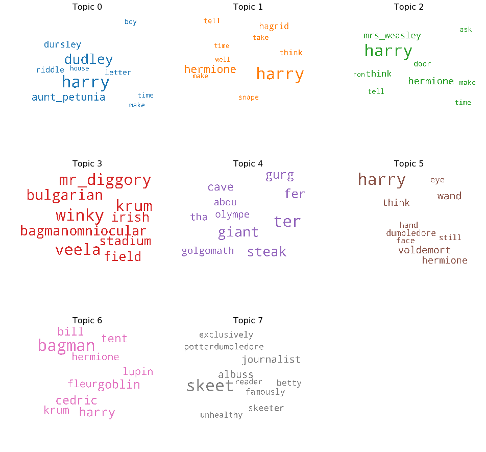

# Harry Potter NLP Technical Exercise

by Matt Devor

# NLP

Natural Language Processing (NLP) is a sub-field of machine learning that attempts to make human languages (e.g. English, French, Mandarin) machine readable and interpretable. 
NLP poses notoriously difficult challenges, including the ambiguity of written text, the variability of meaning given context, the use of slang, idioms and abbreviations, the use of metaphor and analogy, and deciphering the true intent of a writer.

The nuts and bolts of NLP include all of the following:
1. Text extraction in a conistent and reliable format from multiple channels across multiple sources of truth.
2. Text sanitization including removal of artifacts from web sources such as url-encoding, HTML markup, CSS tags and inline javascript.
3. Lemmatization and stemming for normalization.
4. Part-of-speech tagging, named-entity recognition, dependency parsing or other advanced linguistic models.
5. Topic modeling, document clustering or other high-level abstractions.

# Challenge
Let's suppose you never read the Harry Potter series (my sincerest apologies).  
Now suppose you want to get the gist without spending dozens of hours watching the movies or hundreds of hours reading the books (although you really should).  
How could you leverage natural language processing to quickly extract topics, themes, or plotlines?  

Specifically, attempt to algorithmically assign a title and synopsis to each document (in this case let's consider each chapter as a document);
and then repeat the process at the level of topics (that is, identify topics from the corpus of text, and assign a title and synopsis to each topic).

Assume steps 1 & 2 have been completed for you with a robust ETL pipeline.  
Tackle steps 3, 4 and 5, with emphasis on step 5.  
The number of topics and how you present your findings is entirely up to you.  
One catch -- please refrain from using the python library LDAvis -- we want to see how you build from the ground up.  
That said, you may use any other machine learning or NLP library for underlying computations and/or transfer-learning. 

## Guidelnes

1. Do not copy source code from anywhere. We want to see how you would approach this problem yourself.
2. Your code should be written primarily in Python.
3. Your code should run.
4. Don't worry about fancy optimizations, edge cases, bells or whistles.
5. Timebox your efforts to a maximum of 8 hours.
6. The result of your efforts should be a pull-request to this repository. 

## Considerations
Finally, one of the most important considerations for a full-stack data scientist is the ability to write production software. The best model is only as good as its deployment. Please use this opportunity to:

1. Demonstrate your ability to write clean code that is robust, modular and well structured.
3. Demonstrate software engineering best practices including self-documenting code, test-driven development, atomic-commits and source control.

Oh and have fun!


## Table of Contents


# Introduction
I am actually a huge fan of the Harry Potter books, but haven't read them lately, so this project was a great refresher for me.

As far as approaching this problem, I divided it into two main chunks: 
- **Text Summarization**: I did quite a bit of research before diving in, and learned that there are two main categories of text summarization techniques, **Extractive** and **Abstractive**. 
  - I chose to focus on extractive techniques for this project, as the models I researched that use abstracive summarization are primarily deep learning methods that have better results on smaller paragraphs, vs. the entire chapters that need to be summarized for this project. 
  - Below, I have presented several text summarization methodologies, and the methodology I consider the best has been implemented in the final version of the code. 
- **Topic Modeling**: For topic modeling, I chose to use Latent Dirichlet Allocation, due to its ease of interpretation, and the robust model the Gensim library contains. NMF and SVD would potentially be valid techniques as well, and could be an area to explore further. 


[Back to Top](#Table-of-Contents)

# Strategy and Process
- Overview of Data
- Text Summarization
- Topic Modeling: LDA with Gensim/spaCy
- Combining Summarization and Topic Modeling
- Reflection and Future Work

# Overview of the Data
- This dataset consists of the full extracted text of all seven of the Harry Potter books, and includes the following fields:
  - book_author: J.K. Rowling for all books (string)
  - book_name: Name of each book (string)
  - chapter: Chapter number (integer)
  - chapter_name: Name of chapter (string)
  - extracted_text: Entire text of the chapter (string)
- There are 198 chapters total
- Initial EDA of the dataset is as follows. Note the books are in the order of the initial .csv, which is not necessarily chronological.

|   Book Name  | Total Chapters             | Total Word Count |  | Writers                     | Director      |   Percent Positive |   Percent Negative |
|----:|:------------------|:----------|:----------------------------|:--------------|-------------------:|-------------------:|
|Harry Potter and the Chamber of Secrets| 18 | 16-Jan-91 | Larry David, Jerry Seinfeld | Tom Cherones  |           0.32 |           0.25  |
|   2 | The Pony Remark   | 30-Jan-91 | Larry David, Jerry Seinfeld | Tom Cherones  |           0.28     |           0.24     |
|   8 | The Little Kicks  | 10-Oct-96 | Spike Feresten              | Andy Ackerman |           0.29 |           0.23 |
|   2 | The Baby Shower   | 16-May-91 | Larry Charles               | Tom Cherones  |           0.24 |           0.23  |
|   2 | The Jacket        | 6-Feb-91  | Larry David, Jerry Seinfeld | Tom Cherones  |           0.29 |           0.23 |


[Back to Top](#Table-of-Contents)

# Text Summarization


# Topic Modeling: LDA with Gensim/spaCy

Latent Dirichlet Allocation is an unsupervised modeling technique, used to derive (k=num_topics) latent topics from corpuses of text (collections of documents). There are many examples of real-world use cases for this technique, such as search engines, text to speech, classifying social media users, and many more. 

Gensim makes it very easy to create bigram and or trigram models, and spaCy's lemmitization feature allows one to take use the parts of speech they are interested in. In this case, I decided to only use nouns, adjectives, verbs, and adverbs, in order to reduce the amount of words that would be less useful to differentiate topics. 

The LDA algorithm takes an input X matrix (which is the term document frequecy matrix from the corpus) and creates phi and theta matrices, which relate to the input matrix as follows:

| Matrix | Dimensions| Relates | Contains |
|---|---|---|---|
|X (input) | n x m | documents (n rows) to features/words (m columns) | Term frequency matrix of tokenized words, i.e. the number of times each word appears in each document. |
|φ (phi) | k x m | topics (k rows) to features/words (m columns) | Composition of topics, in terms of which words comprise each topic. All rows sum to 1. |
|θ (theta) | n x k | documents (n rows) to topics (k columns) | Topic distribution within each document. Each document can contain multiple topics. All rows sum to 1. |

As with any unsupervised modeling technique, as there is nothing we are really "predicting" with this approach, it is quite difficult to accurately evaluate an LDA model quantitatively. Much of the value gained from topic modeling, and LDA specifically, is the ability to come up with a human-comprehensible understanding of the topics the model spits out. While optimally this topic labelling can be done by looking at the most important keywords for each topic, it can still be quite difficult to separate topics into concrete "buckets".

 I took the following steps to clean the data and feed it through Gensim's LDA model. The corpus in this case is the text from each chapter, and I'm treating each chapter as a document.
1. Remove all punctuation, convert to lower case, and split each document into individual words.
2. Remove stopwords, create bigrams (so important two-word phrases are captured, and lemmatize each word. 
3. Choose k = num_topics.
4. Create LDA model using Gensim.
5. Look **manually** at most important key words for each topic, and if words are repeated often between topics, add to stopwords list, and re-run the LDA model.

In order to have a more quantitative approach to evaluating an LDA model, I decided to focus on Gensim's "Coherence" score, which is basically of how well a topic model splits documents into easily definable topics. This has been shown to mirror human reasoning better than perplexity, so that is why I chose this metric. 

The plot below shows how the coherence score changes as the number of topics increases. From this chart, it looks like the optimal number of topics is 8, so I decided to use that for the final model. However, there is always a balance between human interpretbility, and number of topics, and it can often be very difficult to assign "good" titles to a large number of topics, depending on the corpus.


Keywords with 8 topics, and these stopwords:

Wordcloud with 8 topics


For this model, I also went through many iterations of adding to the stop words list, and these are the additional stop words I used, in order to see more differentiation between the topics:

```


```





From the chart above, it appeared that 14 topics resulted in a good balance between number of topics and coherence score, as coherence score didn't increase much after that. As such, I then re-ran the gensim LDA model with 14 topics, and the gif below is a two-dimensional representation of those topics, along with the 30 most important words for each topic. As we can see, the bulk of the language used within Seinfeld episodes overlaps considerably, with the episodes that are quite different from the norm being shown as smaller topics that are further away from the first 5.


[Back to Top](#Table-of-Contents)

# Sentiment Analysis


In order to understand this corpus better, and to be able to learn yet another NLP tool, I decided to use NLTK's VADER library to do sentiment analysis on each line of dialogue within the corpus. The aim of sentiment analysis is to gauge the attitude, sentiments, evaluations, attitudes and emotions of a speaker/writer based on the computational treatment of subjectivity in a text. I also think that this sentiment analysis could potentially be useful when evaluating the results of my generative model, and I could even incorporate some sort of feedback loop to increase the positivity or negativity of a character's dialogue.

VADER (Valence Aware Dictionary and sEntiment Reasoner) is a lexicon and rule-based sentiment analysis tool that is specifically attuned to sentiments expressed in social media. VADER uses a combination of A sentiment lexicon is a list of lexical features (e.g., words) which are generally labelled according to their semantic orientation as either positive or negative. Also, VADER doesn't require any training data, which means it can be used right out of the box.

Example of a line of dialogue with positive sentiment:
```
Jerry: You know George they are doing wonderful things at mental institutions these days. I'd be happy to set-up a meet and greet.

{'neg': 0.0, 'neu': 0.65, 'pos': 0.35, 'compound': 0.8658}
```

Example of a line of dialogue with negative sentiment:
```
Kramer: If I don't have a good shower I am not myself. I feel weak and ineffectual. I'm not Kramer.

{'neg': 0.242, 'neu': 0.631, 'pos': 0.127, 'compound': -0.296}
```

The sentiment for the entire series is as follows:
- Positive lines: 31%
- Negative lines: 16%
- Neutral lines: 53%

The plot below shows how sentiment changes over the seasons. We can see that season two by far has largest % of negative lines, and season 6 is the most positive. I thought it was interesting that the number of negative lines seemed to trend with the number of episodes Larry David wrote.


The chart below shows how each main character's sentiment changes over the seasons. As we can see, George gets very negative in season two, and then he an all the other characters have less negative lines as time goes on. We can also see that Kramer gets more and more positive as the seasons go on. 


##  Episodes with the Highest Percentage of Negative Lines

|   Season  | Title             | AirDate   | Writers                     | Director      |   Percent Positive |   Percent Negative |
|----:|:------------------|:----------|:----------------------------|:--------------|-------------------:|-------------------:|
|   2 | The Ex-Girlfriend | 16-Jan-91 | Larry David, Jerry Seinfeld | Tom Cherones  |           0.32 |           0.25  |
|   2 | The Pony Remark   | 30-Jan-91 | Larry David, Jerry Seinfeld | Tom Cherones  |           0.28     |           0.24     |
|   8 | The Little Kicks  | 10-Oct-96 | Spike Feresten              | Andy Ackerman |           0.29 |           0.23 |
|   2 | The Baby Shower   | 16-May-91 | Larry Charles               | Tom Cherones  |           0.24 |           0.23  |
|   2 | The Jacket        | 6-Feb-91  | Larry David, Jerry Seinfeld | Tom Cherones  |           0.29 |           0.23 |

**Synopsis for "The Ex-Girlfriend":**

George wants to break up with his girlfriend Marlene, whose tendency to drag out conversations and phone messages irritates him to no end. After an emotional split, he realizes he has left some books in her apartment. Jerry tries to convince George that he does not need the books, as he has already read them, but George nevertheless persuades Jerry to get them for him. To retrieve the books, Jerry decides to go on a date with Marlene, during which she tells him that she and Jerry can still be friends, despite her recent break-up. Jerry and Marlene start dating, but after a while, Jerry finds her just as annoying as George did. He wants to break up with her, but finds she has a "psycho-sexual" hold on him.

## Episodes with Highest Percentage of Positive lines

|  Season  | Title               | AirDate   | Writers                      | Director           |   Percent Positive |   Percent Negative |
|---:|:--------------------|:----------|:-----------------------------|:-------------------|-------------------:|-------------------:|
| 4 | The Trip (1)        | 12-Aug-92 | Larry Charles                | Tom Cherones       |           0.42 |          0.12  |
|  1 | Good News, Bad News | 5-Jul-89  | Larry David, Jerry Seinfeld  | Art Wolff          |           0.42 |          0.15  |
|  5 | The Fire            | 5-May-94  | Larry Charles                | Tom Cherones       |           0.41 |          0.15  |
| 4 | The Visa            | 27-Jan-93 | Peter Mehlman                | Tom Cherones       |           0.41 |          0.17  |
| 6 | The Secretary       | 8-Dec-94  | Carol Leifer, Marjorie Gross | David Owen Trainor |           0.41 |          0.10 |

**Synopsis for "The Trip":** 

Jerry is offered two free tickets from New York City to Hollywood to appear on The Tonight Show with Jay Leno. He offers one to George and they decide that while they are in Los Angeles they will track down Kramer, who headed to Los Angeles in the previous episode, "The Keys", to become an actor. A dead woman turns up in another part of LA and Kramer's script he had given to her is found on her body. George thinks he has insightful conversations with the talk show guests (Corbin Bernsen and George Wendt) but they both call him "some nut" when they appear publicly. 

[Back to Top](#Table-of-Contents)

## Tying Previous Analysis Together
In order to cohesively combine all of the above analysis, I thought it'd be fun to take a look at one of my favorite episodes, and see how it looks with respect to topic modeling and sentiment analysis. 

Epside name: **"The Summer of George"**
- **Season:** 8
- **Writers:** Alec Berg, Jeff Schaffer
- **Synopsis:** George discovers he has a severance package from the New York Yankees that should last him about 3 months, so he decides that he's going to take full advantage of 3 months off and become very active. However, instead of living a very active lifestyle as he'd planned, George becomes extremely lazy. He never changes out of his pajamas, and feels too weak to even come to Jerry's apartment, asking Jerry, Elaine and Kramer to instead visit him or talking to Jerry on the phone to know what's going on over at his apartment.
- **Dominant Topic using sklearn:** 1 (general episodes)
  - Keywords: "door, head, better, jerrys, long, hell, leave, thank, lot, guys"
- **Dominant Topic using Gensim/spaCy:** 5 (general episodes)
  - Keywords: "door, break, door, break, walk, guess, apartment, turn, place, run, hell, room"
- **Dominant Topic using optimal topic model:** 1 (general episodes)
  - Keywords: "run, hell, turn, problem, wait, point, hold, help, even, door"
- **Positive Lines:** 27%
- **Negative Lines:** 17%
- **George Positive lines:** 27%
- **George Negative lines:** 12%

Similar episodes using cosine pairwise distance: 

| Title | Season | Writers | Synopsis | 
| --- | --- | --- | --- | 
| The Barber    | 5 | Andy Robin | At a job interview, George's interviewer, Mr. Tuttle, is cut off mid-sentence by an important telephone call, and sends George away without saying whether he has been hired or not. Mr. Tuttle told George that one of the things that make George such an attractive hire is that he can "understand everything immediately", so George is afraid to call and ask for clarification. |
|  The Suicide | 3 | Tom Leopold  | After his neighbor Martin tries to commit suicide and ends up in a coma, Jerry is hit on by his girlfriend, Gina. Elaine and George visit a psychic at her apartment, who warns George to cancel his vacation to the Cayman Islands. When Elaine rebukes her for smoking while pregnant, the psychic kicks them out before telling George why he should cancel.|
| The Burning | 9 | Jennifer Crittenden  | At the coffee shop, George laments to Jerry about losing respect at a project meeting led by Mr. Kruger after following a good suggestion with a bad joke. Jerry suggests that George use the Vegas showmanship trick of leaving the room after a comedic high note. |
| The Fusilli Jerry | 6 | Marjorie Gross | Kramer goes to the Department of Motor Vehicles for his new license plate. To his surprise, the plate reads "ASSMAN". He suspects that the plate was meant for a proctologist, and uses this theory to his advantage, by parking in a "Doctors Only" spot when he goes to pick up Estelle. The plate also scores him cat calls from passing drivers, and a date with a big-bottomed woman named Sally.|
| The Good Samaritan| 3 | Peter Mehlman | Jerry witnesses a hit-and-run driver hitting another car. He is on the car phone with Elaine, who tells him he has to go after the driver. He does, but when the driver steps out he sees that she is a beautiful woman named Angela (played by Melinda McGraw) and decides to date her. Jerry lies to Elaine, saying he pursued the driver into Queens and intimidated him with karate moves. |

[Back to Top](#Table-of-Contents)

# Text Generation
While I haven't done much with text generation yet, I have been looking into several options for my model, and will most likely use a LSTM RNN as my final model. There are quite a few different methodologies that can be applied when creating these types of models, and the three main ways to generate text are character-based, word-based, and word-vector based. In a character-based model, the prediction happens one character at a time, with the neural network inputs being the sequence of characters before the character being predicted. This allows for the number of potential predictions (y-values) to be quite small, in that it's only: `letters in the alphabet + digits 0-9 + punctuation`.

For my first model, I used the following parameters:
- **Window size:** sequence of 60 characters, predict the 61st
- **Potential alphanumeric characters:** 50 (letters in the alphabet + digits 0-9 + punctuation)
- **Total Alphanumeric characters** used to create X and y values: 100,000
- **X matrix size**: (99,940 x 60 x 50)
- **y matrix size**: (99,940 x 50)
- **LSTM layers:** 1
- **Neurons in that layer:** 228
- **Total Epochs:** 20
- **Best accuracy:** Train: 71% Test: 62% 

I realized through trial and error that much of the difficulty in creating an LSTM model is in vectorizing the text into X and y values.
Below shows a few examples of how I am segmenting the text into sequences and chracters to predict for the initial character-based LSTM model.


This results in the following X (sequence) and y (target) matrices:


I thought it would be interesting to see how this basic model would predict dialogue using a prompt from "The Summer of George". 

Sample Dialogue from "The Summer of George":
```
george: all right, that's enough. i gotta go home and take a nap. 

jerry: it's 10:30 in the morning? 

george: i tell you; i'm wiped. 

jerry: so, has the summer of george already started or are you still de-composing? 

george: de-compressing. 
```

Predicting dialogue using first line from above, with a low temperature value (less randomness):
```
Seed Text:
george: all right, that's enough. i gotta go home and take a . 

Predicted Dialogue:
george: all right, that's enough. i gotta go home and take a shower? 

jerry: i dont know. i dont know. i dont know. i think i do that. 

jerry: i dont know. i dont know. i have to get the shoe off on the stock with women around the signal! 

jerry: what do you know what i would point to that i dont know.

```

Predicting dialogue using first line from above, with a high temperature value (more randomness):
```
Seed Text:
george: all right, that's enough. i gotta go home and take a . 

Predicted Dialogue:
george: all right, that's enough. i gotta go home and take at this couch with a problem put the elevator 
in from got over there right now. 

jerry: you can i tester. 

jerry: what was the car? 

george: hes a persot. i hate the dryer sellised in the bitco moving out with this problem to get the lobby 
tickets to the eggees to come to play should see is we have a lot of here. 

jerry: so what i do? i love her
```

With low temperature values, I noticed that almost all the characters were saying **"I don't know"** constantly, so I thought my model might be  predicting things completely incorrectly.
But then I found [this](https://www.youtube.com/watch?v=xr3Tjx-e71c), and my model totally makes sense now! ;)

[Back to Top](#Table-of-Contents)

# Reflection and Future Work
## Reflection
- Overall, this was a really fun corpus to work with, and I learned a lot about Seinfeld, in the process of learning much more about NLP.
- I realized that topic modeling can often be very difficult to draw conclusions from , but will still give you insights related to your documents, even if you can't discern concrete "topics".
- Sentiment analysis using VADER is really quick and easy to use right out of the box.
- Even a character-based LSTM model is pretty amazing, in that it's able to produce somewhat coherent sentences and dialogue.

## Future Work
- I would like to continue with text generation/prediction, creating more of a back-and-forth dialogue model using several potential approaches:
  - Character-based 
  - Character-based: seq2seq
  - Word-based
  - Word-vector based
  - Chatbot based approach (questions and answers)
- A few limitations with these models will be training time, as with trying to predict a word using the N words before that word, the  prediction space is suddenly your entire vocabulary! 
- This makes for a potentially HUGE (6,500+ depending on vocab) # of word prediction options, which will in turn require much more processing power.
- However, I believe that these types of model "might" be more accurate overall, in that they can internally take the context of each word into account, within the LSTM neural network.

[Back to Top](#Table-of-Contents)


[(0,
  '0.010*"fudge" + 0.007*"prime_minister" + 0.005*"wizard" + '
  '0.005*"dumbledore" + 0.004*"think" + 0.004*"dementor" + 0.004*"frank" + '
  '0.004*"witch" + 0.004*"ask" + 0.004*"riddle"'),
 (1,
  '0.016*"slughorn" + 0.008*"ogden" + 0.007*"morfin" + 0.006*"gaunt" + '
  '0.005*"muggle" + 0.005*"think" + 0.004*"krum" + 0.004*"wizard" + '
  '0.004*"tent" + 0.003*"wear"'),
 (2,
  '0.012*"hagrid" + 0.007*"greyback" + 0.007*"wand" + 0.006*"centaur" + '
  '0.005*"shout" + 0.005*"fly" + 0.005*"death_eater" + 0.005*"malfoy" + '
  '0.004*"face" + 0.004*"tree"'),
 (3,
  '0.007*"think" + 0.006*"tell" + 0.005*"ron" + 0.005*"snape" + 0.005*"malfoy" '
  '+ 0.005*"take" + 0.005*"make" + 0.005*"time" + 0.004*"hagrid" + '
  '0.004*"want"'),
 (4,
  '0.007*"dudley" + 0.006*"think" + 0.005*"take" + 0.005*"time" + 0.005*"make" '
  '+ 0.004*"tell" + 0.004*"door" + 0.004*"well" + 0.004*"eye" + 0.004*"turn"'),
 (5,
  '0.024*"hagrid" + 0.007*"think" + 0.006*"tell" + 0.006*"mrs_weasley" + '
  '0.006*"ask" + 0.005*"want" + 0.005*"well" + 0.005*"ter" + 0.005*"take" + '
  '0.004*"bill"'),
 (6,
  '0.002*"portkey" + 0.002*"amos_diggory" + 0.001*"apparat" + '
  '0.001*"stoatshead" + 0.001*"hill" + 0.001*"toffee" + 0.001*"mr_weasley" + '
  '0.001*"ticket" + 0.001*"hilltop" + 0.001*"porridge"'),
 (7,
  '0.008*"wand" + 0.008*"voldemort" + 0.007*"think" + 0.006*"snape" + '
  '0.005*"dumbledore" + 0.005*"eye" + 0.005*"still" + 0.005*"tell" + '
  '0.005*"face" + 0.005*"hand"')]


# 9 Topics, Harry and Hermoine added to stop words.
  [(0,
  '0.010*"fudge" + 0.007*"prime_minister" + 0.005*"wizard" + '
  '0.005*"dumbledore" + 0.004*"think" + 0.004*"dementor" + 0.004*"frank" + '
  '0.004*"witch" + 0.004*"ask" + 0.004*"riddle"'),
 (1,
  '0.016*"slughorn" + 0.008*"ogden" + 0.007*"morfin" + 0.006*"gaunt" + '
  '0.005*"muggle" + 0.005*"think" + 0.004*"krum" + 0.004*"wizard" + '
  '0.004*"tent" + 0.003*"wear"'),
 (2,
  '0.012*"hagrid" + 0.007*"greyback" + 0.007*"wand" + 0.006*"centaur" + '
  '0.005*"shout" + 0.005*"fly" + 0.005*"death_eater" + 0.005*"malfoy" + '
  '0.004*"face" + 0.004*"tree"'),
 (3,
  '0.007*"think" + 0.006*"tell" + 0.005*"ron" + 0.005*"snape" + 0.005*"malfoy" '
  '+ 0.005*"take" + 0.005*"make" + 0.005*"time" + 0.004*"hagrid" + '
  '0.004*"want"'),
 (4,
  '0.007*"dudley" + 0.006*"think" + 0.005*"take" + 0.005*"time" + 0.005*"make" '
  '+ 0.004*"tell" + 0.004*"door" + 0.004*"well" + 0.004*"eye" + 0.004*"turn"'),
 (5,
  '0.024*"hagrid" + 0.007*"think" + 0.006*"tell" + 0.006*"mrs_weasley" + '
  '0.006*"ask" + 0.005*"want" + 0.005*"well" + 0.005*"ter" + 0.005*"take" + '
  '0.004*"bill"'),
 (6,
  '0.002*"portkey" + 0.002*"amos_diggory" + 0.001*"apparat" + '
  '0.001*"stoatshead" + 0.001*"hill" + 0.001*"toffee" + 0.001*"mr_weasley" + '
  '0.001*"ticket" + 0.001*"hilltop" + 0.001*"porridge"'),
 (7,
  '0.008*"wand" + 0.008*"voldemort" + 0.007*"think" + 0.006*"snape" + '
  '0.005*"dumbledore" + 0.005*"eye" + 0.005*"still" + 0.005*"tell" + '
  '0.005*"face" + 0.005*"hand"')]